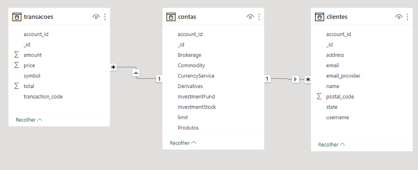
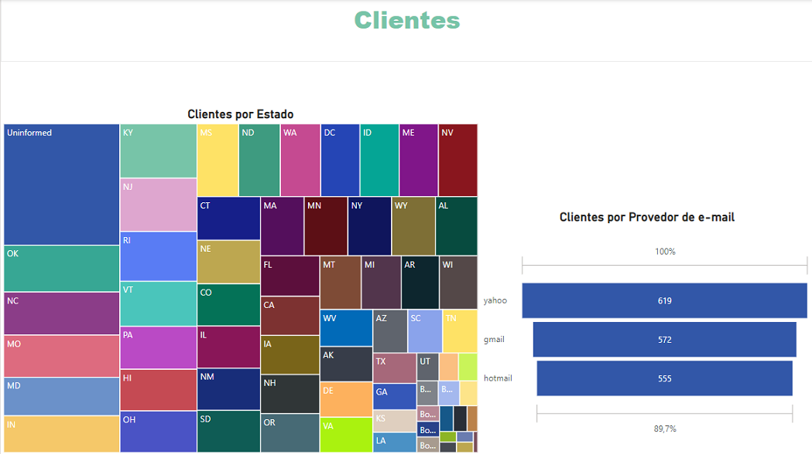
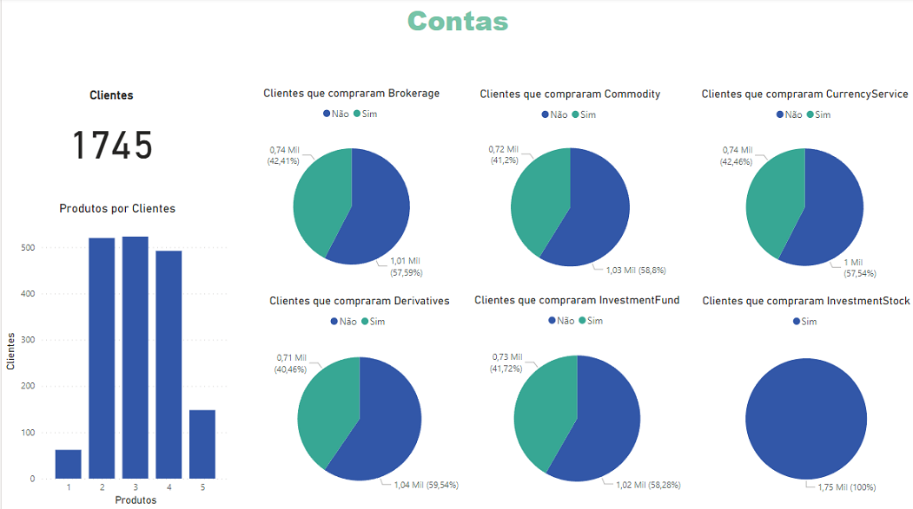
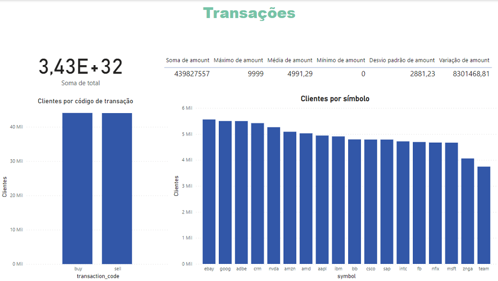

# Lab 2 - Power BI Para Análise de Dados Financeiros Armazenados em Data Lake
O Data Lake em questão foi considerado como uma base com 3 collections no Banco de Dados NoSQL MongoDB.
Foi proposto, inicialmente, que o Power BI deveria se conectar com o MongoDB via ODBC, 
mas os arquivos foram extraídos em formato JSON e carregados no Power BI.

Os arquivos que foram carregados inicialmente no Power BI eram apenas uma amostra dos arquivos forncecidos, e os relacionamentos foram excluídos.
Então as etapas de limpeza e processamento dos dados foram implementadas, e os gráficos gerados. E finalmente os dados restantes foram carregados.

## Arquivos
- Lab2.pbix: arquivo do Power BI.
- Lab2-Dataset.png: print da tabela do datasets modificado.
- Lab2-Relatorio.pdf: Documento pdf gerado pelo Power BI.
- Lab2-Dashboard-Clientes.png: Imagem do Dashboard de clientes.
- Lab2-Dashboard-Contas.png: Imagem do Dashboard de contas.
- Lab2-Dashboard-Transacoes.png: Imagem do Dashboard de transacoes.
- Script-M-Clientes: Arquivo com o código de manipulação dos dados na linguagem M referente a tabela de clientes.
- Script-M-Contas: Arquivo com o código de manipulação dos dados na linguagem M referente a tabela de contas.
- Script-M-Transacoes: Arquivo com o código de manipulação dos dados na linguagem M referente a tabela de transações.

## Formato dos Dados
Os dados estão em 3 arquivos json.
Algumas colunas foram adicionadas, transformadas ou excluídas. 

## Dashboards

## Referências
Data Science Academy - Análise de Dados com Microsoft Power BI e Clínica de BI: 
https://www.datascienceacademy.com.br/course/analise-de-dados-com-microsoft-power-bi-e-clinica-de-bi-dsa
Acessado em 22/04/2023.